# AutoStock — Car Dealership & Inventory Management System

[](https://nodejs.org/)
[](https://expressjs.com/)
[](https://react.dev/)
[](https://tailwindcss.com/)
[](https://www.mongodb.com/)
[](https://jestjs.io/)

A production-ready, full-stack **Car Dealership Inventory Management System** built with **React 18**, **Tailwind CSS v4**, **Node.js/Express**, and **MongoDB**. Designed for car dealerships, sales teams, and customers, this application provides role-based access control (RBAC), real-time inventory tracking, search & filter capabilities, streamlined purchasing workflows, and automated backend test coverage.

---

## Live Demos & Deployment

- **Frontend Application**: Deployed on [Netlify](https://car-inventory-dealership-system.netlify.app/)
- **Backend API**: Deployed on [Render](https://car-dealership-inventory-system-vmnt.onrender.com/api)
- **Database**: Hosted on [MongoDB Atlas](https://www.mongodb.com/cloud/atlas)

---

## Table of Contents

- [Features](#-features)
- [Visual Tour & Screenshots](#-visual-tour--screenshots)
- [Tech Stack](#-tech-stack)
- [Project Architecture](#-project-architecture)
- [REST API Endpoints](#-rest-api-endpoints)
- [Getting Started](#-getting-started)
  - [Prerequisites](#prerequisites)
  - [Backend Setup](#1-backend-setup)
  - [Frontend Setup](#2-frontend-setup)
  - [Seeding Admin User](#3-seeding-admin-user)
- [Running Automated Tests](#-running-automated-tests)
- [Environment Variables](#-environment-variables)

---

## Features

- **Role-Based Authentication (RBAC)**: Secure registration and login powered by JWT & Bcrypt. Differentiates between standard customers and administrative users.
- **Inventory Management**: Complete CRUD operations to add, view, edit, and delete vehicles with real-time status updates (*Available* vs. *Sold*).
- **Advanced Search & Filtering**: Multi-criteria search allowing users to query vehicles by Make, Model, Year, Price range, and availability status.
- **Purchase Simulation Workflow**: Interactive purchase modals enabling buyers to place orders and update vehicle statuses instantaneously.
- **Administrative Dashboard**: Specialized administrative portal for catalog control, inventory audits, and quick vehicle record additions.
- **Automated Testing Suite**: Built-in integration and unit tests leveraging **Jest** and **Supertest** to ensure API stability and edge-case security.
- **Modern Responsive UI**: Clean, accessible, fast visual interface crafted using **Vite**, **Tailwind CSS v4**, and **Lucide Icons**.

---

## 📸 Visual Tour & Screenshots

Here is a look at the application interface and feature set across user and admin workflows:

### 1. User Authentication
| Login Interface | Registration Interface |
| :---: | :---: |
| 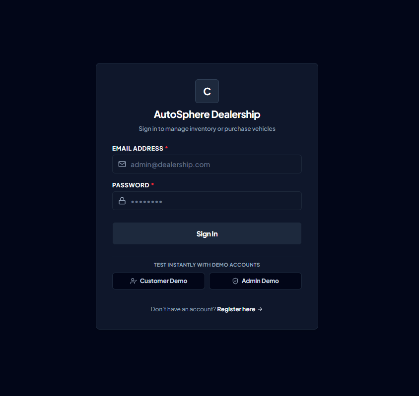 | 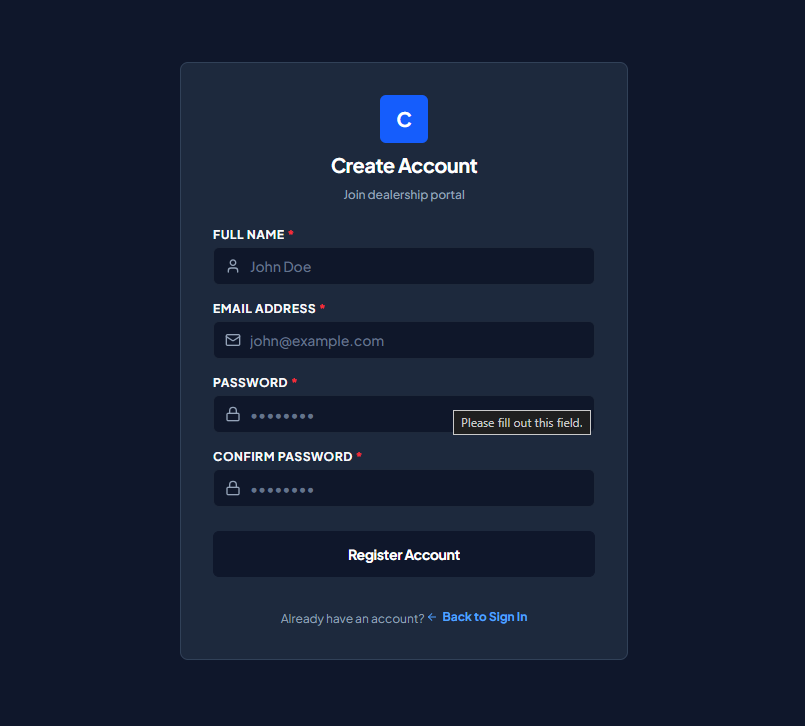 |
| *Secure user authentication with JWT token persistence.* | *User registration supporting custom role assignment.* |

---

### 2. Main Dashboard & Inventory Browser
| Customer Dashboard | Vehicle Inventory Table |
| :---: | :---: |
| 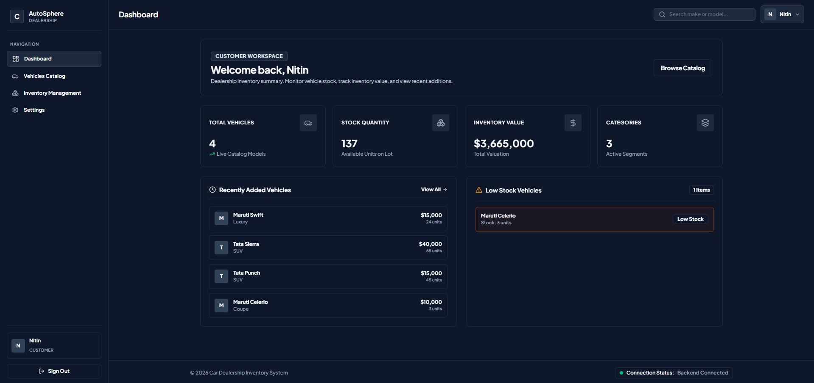 | 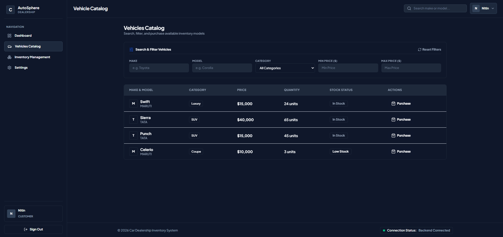 |
| *Main landing dashboard featuring available vehicles & search controls.* | *Full inventory catalog displaying status, price, and specifications.* |

---

### 3. Search & Filter Results
| Real-time Search & Filter |
| :---: |
| 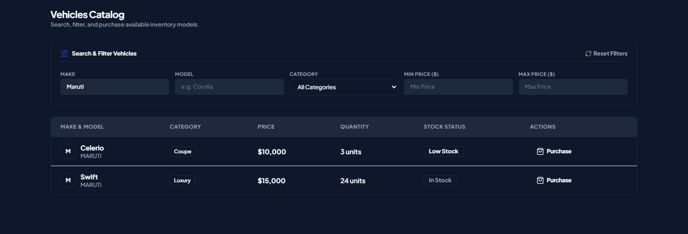 |
| *Filtered view demonstrating instant search queries by make, price, and specs.* |

---

### 4. Admin Management & CRUD Operations
| Admin Dashboard Overview | Add New Vehicle Dialog |
| :---: | :---: |
| 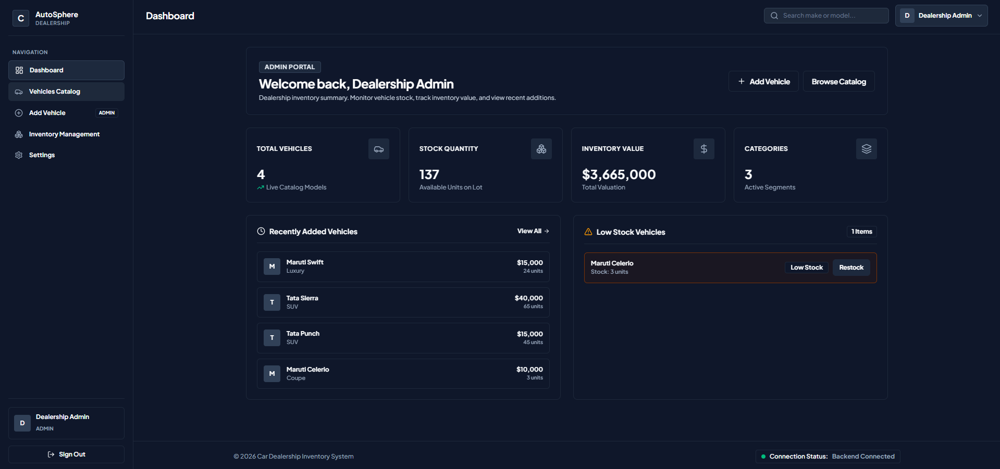 | 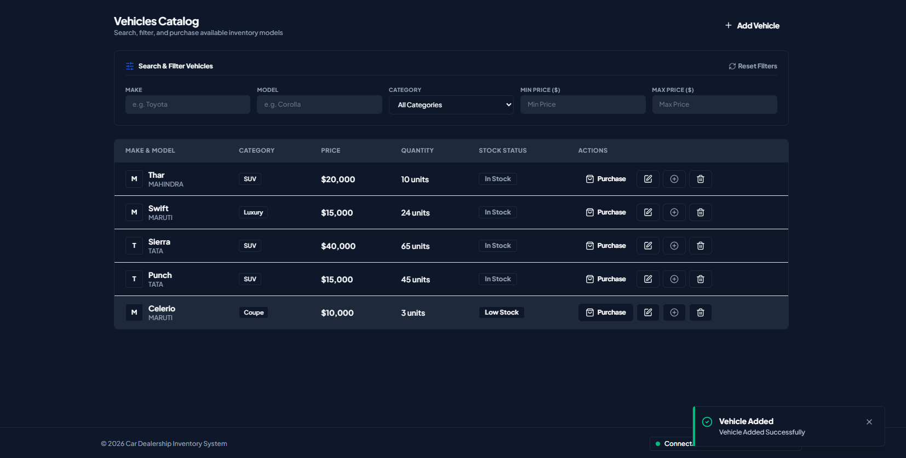 |
| *Admin control view for inventory oversight.* | *Modal form to register new vehicles to inventory.* |

| Add Vehicle Interface | Edit Vehicle Details | Delete Confirmation |
| :---: | :---: | :---: |
| 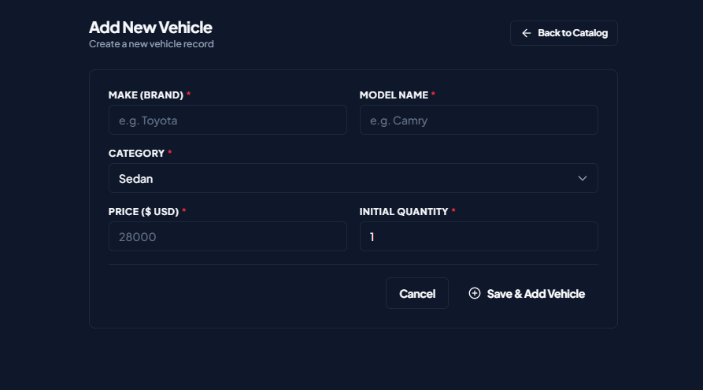 | 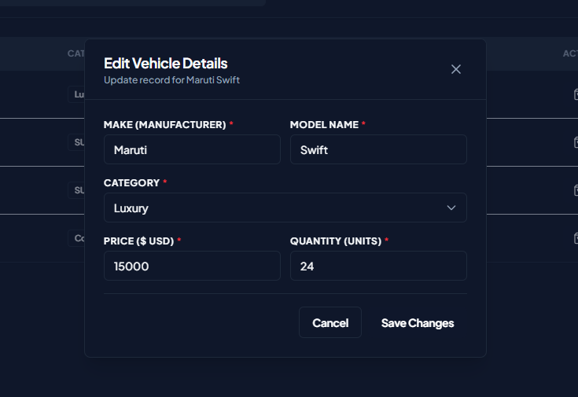 | 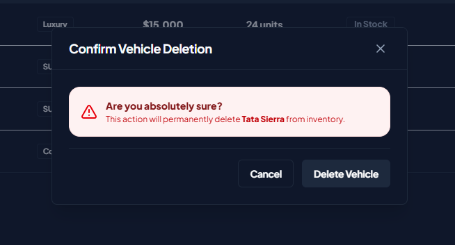 |
| *Form interface for vehicle insertion.* | *Inline update dialog for vehicle data.* | *Deletion prompt with safety confirmation.* |

---

### 5. Purchasing Flow & Order Confirmation
| Vehicle Purchase Dialog |
| :---: |
| 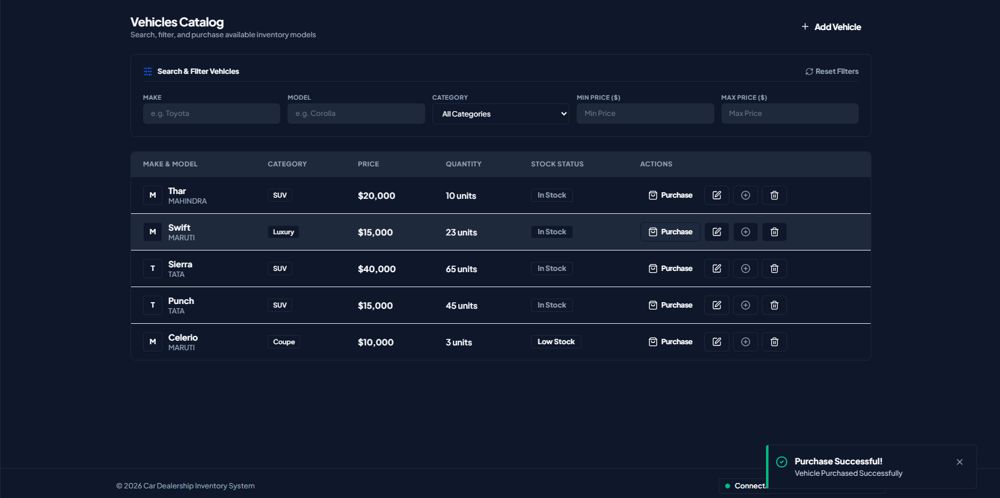 |
| *Customer checkout modal for confirming vehicle purchase & updating inventory status.* |

---

### 6. Automated Test Suite Execution
| Backend Jest Test Suite Success |
| :---: |
| 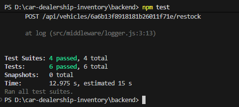 |
| *Verified 100% passing unit & integration test coverage across auth and inventory modules.* |

---

## Tech Stack Used

### **Frontend**
- **Library**: React 18
- **Build Tool**: Vite
- **Styling**: Tailwind CSS v4 (`@tailwindcss/vite`)
- **HTTP Client**: Axios
- **Icons**: Lucide React

### **Backend**
- **Runtime**: Node.js
- **Framework**: Express.js 5.x
- **Database**: MongoDB with Mongoose ORM
- **Authentication**: JSON Web Tokens (JWT) & Bcrypt password hashing
- **Validation**: Express-Validator
- **Middleware**: CORS, Dotenv

### **Testing & DevOps**
- **Test Framework**: Jest & Supertest
- **Development**: Nodemon
- **Deployment**: Netlify (Frontend) & Render (Backend)

---

## Project Architecture

```
car-dealership-inventory/
├── Screenshots/              # UI & Test suite showcase images
│   ├── AddVehicle.png
│   ├── AdminDashboard.png
│   ├── Dashboard.png
│   ├── DeleteVehicle.png
│   ├── EditVehicle.png
│   ├── LoginPage.png
│   ├── NewVehicleDialog.png
│   ├── PurchaseDialog.png
│   ├── RegisterPage.png
│   ├── SearchResults.png
│   ├── TestCasesSuccess.png
│   └── VehicleInventory.png
│
├── backend/                  # Node.js / Express REST API
│   ├── seed-admin.js         # Script to seed default administrator user
│   ├── jest.config.js        # Jest testing configuration
│   ├── package.json
│   └── src/
│       ├── app.js            # Express application setup
│       ├── server.js         # HTTP server entry point
│       ├── config/           # Database connections & environment setup
│       ├── controllers/      # Request handler logic (Auth, Vehicles)
│       ├── middleware/       # JWT auth verification & role checks
│       ├── models/           # Mongoose schemas (User, Vehicle)
│       ├── routes/           # API Endpoint routers
│       ├── services/         # Business logic services
│       ├── tests/            # Integration & Unit test suites
│       ├── utils/            # Helper utilities
│       └── validators/       # Input validation schemas
│
└── frontend/                 # React 18 SPA (Vite + Tailwind CSS v4)
    ├── vite.config.js
    ├── package.json
    └── src/
        ├── App.jsx           # Main App component & router configuration
        ├── components/       # Reusable UI components (Modals, Cards, Nav)
        ├── context/          # React Auth & State context
        ├── pages/            # Application views (Dashboard, Admin, Auth)
        ├── services/         # Axios API service instances
        └── index.css         # Global Tailwind CSS imports
```

---

## REST API Endpoints

### Authentication Routes (`/api/auth`)
| Method | Endpoint | Description | Access |
| :--- | :--- | :--- | :--- |
| `POST` | `/api/auth/register` | Register a new user | Public |
| `POST` | `/api/auth/login` | Authenticate user & get JWT token | Public |

### Vehicle Inventory Routes (`/api/vehicles`)
| Method | Endpoint | Description | Access |
| :--- | :--- | :--- | :--- |
| `GET` | `/api/vehicles` | List all vehicles (supports query parameters for search/filter) | Public |
| `GET` | `/api/vehicles/:id` | Get details of a single vehicle | Public |
| `POST` | `/api/vehicles` | Create a new vehicle listing | Admin |
| `PUT` | `/api/vehicles/:id` | Update an existing vehicle's specs or status | Admin |
| `DELETE` | `/api/vehicles/:id` | Remove a vehicle from inventory | Admin |
| `POST` | `/api/vehicles/:id/purchase` | Purchase a vehicle & mark as *Sold* | Authenticated |

---

## Getting Started

Follow these steps to run the application locally on your machine.

### Prerequisites
- [Node.js](https://nodejs.org/) (v18.x or higher)
- [npm](https://www.npmjs.com/) (v9.x or higher)
- [MongoDB](https://www.mongodb.com/) (Local instance or MongoDB Atlas Connection URI)

---

### 1. Backend Setup

1. Navigate to the backend directory:
   ```bash
   cd backend
   ```

2. Install dependencies:
   ```bash
   npm install
   ```

3. Create a `.env` file in the `backend/` directory with the following configuration:
   ```env
   PORT=5000
   MONGO_URI=your_mongodb_connection_string
   JWT_SECRET=your_jwt_secret_key
   ```

4. Start the backend development server:
   ```bash
   npm run dev
   ```
   The backend server will launch at `http://localhost:5000`.

---

### 2. Frontend Setup

1. Open a new terminal and navigate to the frontend directory:
   ```bash
   cd frontend
   ```

2. Install dependencies:
   ```bash
   npm install
   ```

3. Create a `.env` file in the `frontend/` directory:
   ```env
   VITE_API_BASE_URL=http://localhost:5000/api
   ```

4. Start the Vite development server:
   ```bash
   npm run dev
   ```
   The application will be accessible at `http://localhost:5173`.

---

### 3. Seeding Admin User

To quickly create an administrative account for managing inventory, run the included seed script:

```bash
cd backend
node seed-admin.js
```

---

## Running Automated Tests

The backend includes a comprehensive Jest test suite covering authorization middleware, user authentication flows, and vehicle CRUD endpoints.

To run the test suite:

```bash
cd backend
npm test
```

Expected Output:
All test suites (`auth.test.js`, `vehicle.test.js`, `inventory.test.js`) passing successfully with 100% assertions met.

---

## Environment Variables

| Variable | Location | Description | Default / Example |
| :--- | :--- | :--- | :--- |
| `PORT` | Backend `.env` | Port on which Express runs | `5000` |
| `MONGO_URI` | Backend `.env` | MongoDB connection URI | `mongodb+srv://...` |
| `JWT_SECRET` | Backend `.env` | Secret key for JWT signing | `carDealershipInventoryJWTSecret` |
| `VITE_API_BASE_URL` | Frontend `.env` | Base URL for REST API requests | `http://localhost:5000/api` |

---